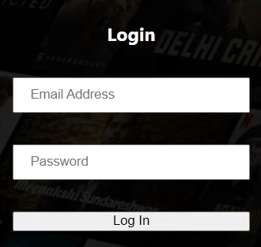
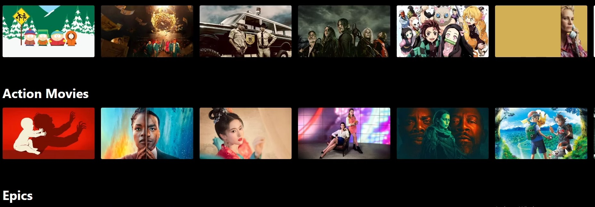
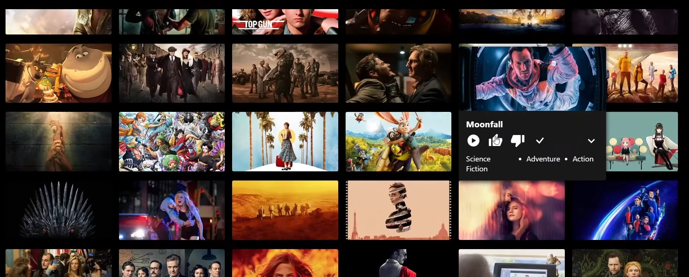
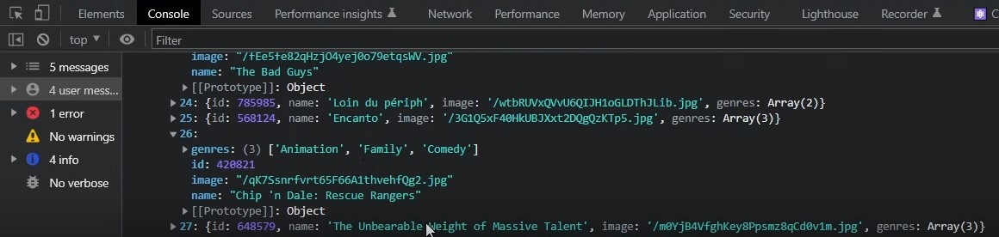
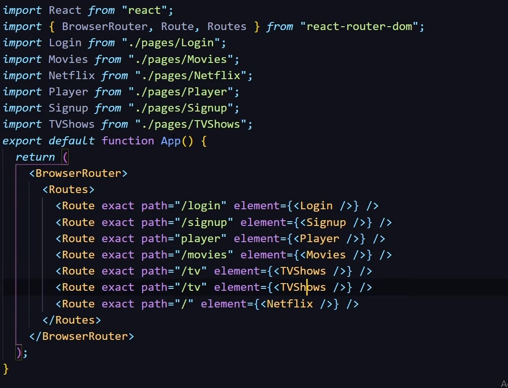

# WarpSpeed MovieFinder

## Description
WarpSpeed MovieFinder is a web application that integrates with the TMDB API to provide users with a tailored interface for exploring and managing their favorite movies. The project is organized into several key components, including a front-end user interface, back-end API management, and database interaction.

## Features  
 
- **TMDB API Integration**: Seamlessly interacts with TMDB's API to fetch and display content.
- **Custom User Interface**: Provides a user-friendly interface for browsing and selecting movies of the users choice.
- **Database Management**: Utilizes a backend database for storing user data and preferences.

## Technologies Used

- **Frontend**: HTML, CSS, JavaScript, React
- **Backend**: Node.js, Express
- **Database**: MongoDB
- **API**: TMDB API

## Photos of site
Login screen to access the main site for WarpSpeed Movie Finder.           

Main page sorting by genres.

Example of adding movies/tv shows via the checkmark to My List page which stores all checked movies/tv shows for viewing later.

Console view of movie parameters such as genre, name, display image of the movie/tv show and it's ID within the API.

How each page is routed within React.

## License
This project is licensed under the MIT License. See the LICENSE tab for more details.

## Contributors
- Cyrus8685
- ConnorLuks
- Nate-Scuderi
